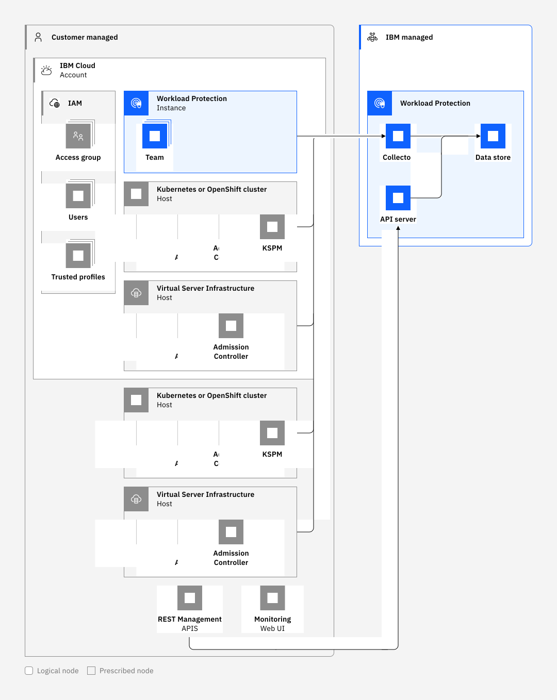

---

copyright:
  years:  2023
lastupdated: "2023-04-14"

keywords: IBM Cloud, security, connection

subcollection: workload-protection

---

{{site.data.keyword.attribute-definition-list}}

# Learning about {{site.data.keyword.sysdigsecure_short}} architecture and workload isolation
{: #compute-isolation}

Review the following sample architecture for {{site.data.keyword.sysdigsecure_full_notm}}, and learn more about the workload isolation level that the service offers in the cloud.
{: shortdesc}

## {{site.data.keyword.sysdigsecure_full_notm}} architecture
{: #architecture}

{{site.data.keyword.sysdigsecure_full_notm}} is a highly available, multi-tenant, regional service that is available in {{site.data.keyword.cloud_notm}}. You can use it to find and prioritize software vulnerabilities, detect and respond to threats, and manage configurations, permissions and compliance from source to run.

{: caption="{{site.data.keyword.sysdigsecure_short}} Architecture" caption-side="bottom"}

The API server component provides a web and an API interface to the service.

The collector component ingests data that agents forward to the service.

The data store component stores all results, metadata, instance credentials, and environmental data.

An agent connects to one instance. The agent forwards data to the instance that is connected.

The UI is the front-end component where users can monitor and configure scans, postures, policies, and alerts.

## {{site.data.keyword.sysdigsecure_short}} workload isolation
{: #workload-isolation}

Each regional deployment of the {{site.data.keyword.sysdigsecure_full_notm}} service serves multiple tenants that are identified by the {{site.data.keyword.IBM_notm}} service instance.

* A region that is responsible for running user workloads in the region has one deployment of the {{site.data.keyword.sysdigsecure_short}} service in the region.

* The {{site.data.keyword.sysdigsecure_short}} service in a region is [highly available](/docs/workload-protection?topic=workload-protection-ha-dr).

* The data that is collected and processed by the {{site.data.keyword.sysdigsecure_short}} service is associated with the instance and not visible to the other service instances by virtue of this association.

* Data for all tenants is located in the same data stores and segmented by the tenant-specific metric tags that are associated with each metric to enforce access control policies.

You can use {{site.data.keyword.cloud_notm}} Identity and Access Management (IAM) to control which users see, create, use, and manage resources in your service instance. [Learn more](/docs/workload-protection?topic=workload-protection-iam).

* To grant access to manage the {{site.data.keyword.sysdigsecure_short}} service in {{site.data.keyword.cloud_notm}}, you can assign platform roles that define users levels of access for completing platform management tasks and accessing account resources.

* Service roles that define levels of access for viewing data and managing features, such as dashboards, teams, and alerts, can be assigned to users. These roles grant access to manage the instance and its resource.
