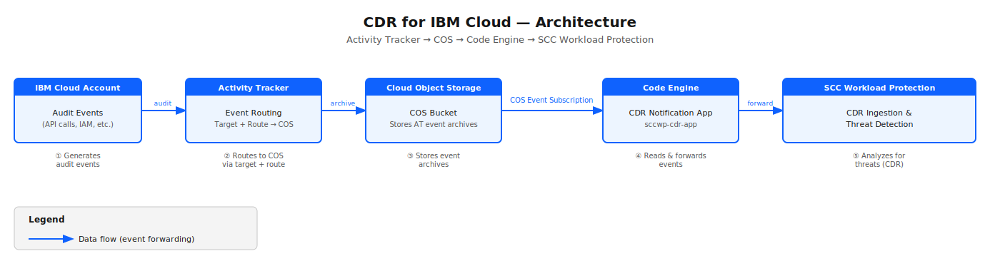

---

copyright:
  years: 2026
lastupdated: "2026-07-01"

keywords:

subcollection: workload-protection

---

{{site.data.keyword.attribute-definition-list}}

# Enabling Detection and Response for {{site.data.keyword.cloud_notm}}
{: #cdr-about}

Cloud Detection and Response (CDR) helps you investigate in near real-time the suspicious activity in your cloud accounts. {{site.data.keyword.sysdigsecure_short}} can ingest and analyze the {{site.data.keyword.cloud_notm}} audit logs to detect potential threats.

The {{site.data.keyword.sysdigsecure_short}} detection and response module supports {{site.data.keyword.cloud_notm}}, multi-cloud environments (Amazon Web Services, Azure and Google Cloud), inside hosts, virtual machines (VSIs for VPC, VMware, PowerVS and IBM Z with Linux), Kubernetes, and OpenShift.
{: note}

CDR monitors cloud workloads and activity in real time, detects threats using curated rules and behavioral techniques to identify a broad range of attacks such as privilege escalation and lateral movement.

With CDR, organizations can detect and respond to threats faster, reducing the impact of security incidents and minimizing downtime.

After you complete the enablement of detection and response for your {{site.data.keyword.cloud_notm}} account, see [Creating {{site.data.keyword.cloud_notm}} Threat Detection policy](/docs/workload-protection?topic=workload-protection-cdr-about#cdr-policy) to define the detections you want for you environment.

## {{site.data.keyword.cloud_notm}} Detection and Response Architecture
{: #cdr-architecture}

{: caption="CDR for IBM Cloud architecture" caption-side="bottom"}

The CDR integration for {{site.data.keyword.cloud_notm}} uses the following data flow:

1. Users and applications generate audit events with the actions in the {{site.data.keyword.cloud_notm}} account. All creation, removals or updates are recorded and tracked.

2. **{{site.data.keyword.atracker_short}}** captures audit events generated across your {{site.data.keyword.cloud_notm}} account and routes them to a {{site.data.keyword.cos_full_notm}} bucket through a configured target and route.

3. **{{site.data.keyword.cos_full_notm}}** stores the auditing events from {{site.data.keyword.atracker_short}}. A {{site.data.keyword.cos_full_notm}} event subscription monitors the bucket and triggers a {{site.data.keyword.codeengineshort}} application each time a new event file is written.

4. **{{site.data.keyword.codeengineshort}}** runs the CDR notification application, which reads the event files from the {{site.data.keyword.cos_short}} bucket using a trusted profile for authentication, and forwards the events to the {{site.data.keyword.sysdigsecure_short}} ingestion endpoint.

5. **{{site.data.keyword.sysdigsecure_short}}** receives and analyzes the forwarded events in near real-time, applying detection rules to identify threats such as privilege escalation, lateral movement, and suspicious API activity.

The connection between components is secured using two IAM objects: a trusted profile, which grants the {{site.data.keyword.sysdigsecure_short}} instance identity access to read from the {{site.data.keyword.cos_short}} bucket; and a **Service ID** with an API key, which authenticates the {{site.data.keyword.codeengineshort}} application when forwarding events to the {{site.data.keyword.sysdigsecure_short}} ingestion endpoint.
{: note}

## Prerequisites
{: #cdr-prereqs}

Before you begin, ensure the following services and permissions are available in your {{site.data.keyword.cloud_notm}} account.

- An existing {{site.data.keyword.sysdigsecure_short}} instance and its CRN. It will be referenced later as `<workload-protection-instance-crn>`. For more information, see [Creating an instance](/docs/workload-protection?topic=workload-protection-provision).
- Your {{site.data.keyword.sysdigsecure_short}} must have CSPM enabled for your {{site.data.keyword.cloud_notm}} account. For more information, see [Implementing CSPM for {{site.data.keyword.cloud_notm}}](/docs/workload-protection?topic=workload-protection-cspm-implement)
- Permissions to manage the following services in your {{site.data.keyword.cloud_notm}} account:
   - **{{site.data.keyword.atracker_short}}**: Editor or Administrator platform role.
   - **{{site.data.keyword.cos_full_notm}}**: Manager service role on the instance.
   - **IAM Identity** (account management): Administrator role to [create Service IDs, API keys, and Trusted Profiles](/docs/iam?topic=iam-create-trusted-profile&interface=ui#tp-roles-reqs).
   - **IAM Access Management** (account management): Administrator role to create IAM policies and service-to-service authorizations.
   - **{{site.data.keyword.codeengineshort}}**: Editor or Manager service role.
   - **{{site.data.keyword.registryshort}}**: Reader service role — required for {{site.data.keyword.codeengineshort}} to pull the CDR application image.
   - **{{site.data.keyword.sysdigsecure_short}}**: Editor or Administrator platform role on the instance.

## Set up {{site.data.keyword.atracker_short}} integration
{: #cdr-implement}

The workflow sends auditing events from {{site.data.keyword.atracker_short}} to {{site.data.keyword.cos_short}}, which triggers a {{site.data.keyword.codeengineshort}} application to forward events to {{site.data.keyword.sysdigsecure_short}} for ingestion and analysis.

### Configure a {{site.data.keyword.cos_full_notm}} target
{: #configure-cos}

{{site.data.keyword.cos_full_notm}} is used as target for {{site.data.keyword.atracker_short}} events. Those events will be later collected by {{site.data.keyword.sysdigsecure_short}} to analyze potential suspicious activity.

Follow the instructions for [Configuring a Cloud Object Storage target](/docs/atracker?topic=atracker-getting-started-target-cos).

After configuring the target, save the following values that will be used in later steps:
- The {{site.data.keyword.cos_short}} **instance name**. It will be referenced as `<your_cos_instance_name>`.
- The {{site.data.keyword.cos_short}} **bucket name**. It will be referenced as `<cos_bucket_name>`.
- The {{site.data.keyword.cos_short}} **bucket region**. It will be referenced as `<cos_bucket_region>`.

   When you configure the {{site.data.keyword.atracker_short}} route, [ensure that the route rule includes the `global` location in addition to your deployment region](/docs/iam?topic=iam-at_events_iam#at-viewing-iam). IAM events such as account settings changes, MFA modifications, policy deletions, and context-based restriction changes are generated as global events and are not routed unless `global` is explicitly included.

   Without the `global` location, IAM mutation events will not reach the {{site.data.keyword.cos_short}} bucket and will not be analyzed by {{site.data.keyword.sysdigsecure_short}}.
   {: important}

### Create a Service ID and API Key
{: #create-api}

Create the Service ID and one API key for the {{site.data.keyword.codeengineshort}} application to send events to your {{site.data.keyword.sysdigsecure_short}} instance.

```sh
ibmcloud iam service-id-create send-cdr-events-id --description "Service ID for CDR event forwarding"
```
{: pre}

```sh
ibmcloud iam service-api-key-create send-cdr-events-key send-cdr-events-id --description "API Key for CDR app"
```
{: pre}

Save the generated API key and the Service ID identifier (the `ServiceId-xxx` value returned by the first command). Both will be used in the following steps.
{: note}

Grant the Service ID Reader access to the {{site.data.keyword.registrylong}} so that {{site.data.keyword.codeengineshort}} can pull the CDR application image:

```sh
ibmcloud iam service-policy-create send-cdr-events-id --roles Reader --service-name container-registry
```
{: pre}

###  Create the trusted profile for reading {{site.data.keyword.cos_short}} events
{: #create-tp}

Create the trusted profile (you can modify the name). Save the `ID` to be used later. It will be referenced later as `<trusted_profile_id>`:

```sh
ibmcloud iam trusted-profile-create ibmcdr-wp-cos --description "Trusted profile for Workload Protection interaction with Cloud Object Storage bucket"
```
{: pre}

Assign the trust relationship for the {{site.data.keyword.sysdigsecure_short}} instance. Replace `<workload-protection-instance-crn>` with your {{site.data.keyword.sysdigsecure_short}} CRN:

```sh
ibmcloud iam trusted-profile-identity-create ibmcdr-wp-cos --id <workload-protection-instance-crn> --id-type CRN
```
{: pre}

Assign the trust relationship for the Service ID created in step 2. Replace `<service_id>` with the Service ID identifier (`ServiceId-xxx`):

```sh
ibmcloud iam trusted-profile-identity-create ibmcdr-wp-cos --id <service_id> --id-type serviceid
```
{: pre}

Create the policy for the trusted profile for the {{site.data.keyword.cos_full_notm}} reader. Replace `<cos_bucket_name>` with the bucket name created in the step 1:

```sh
ibmcloud iam trusted-profile-policy-create ibmcdr-wp-cos -r "Content Reader,Reader" --service-name cloud-object-storage --resource-type bucket --resource <cos_bucket_name>
```
{: pre}

Create the policy for the trusted profile for accessing the CDR Service ID. Replace `<service_id>` with the Service ID created in step 2:

```sh
ibmcloud iam trusted-profile-policy-create ibmcdr-wp-cos -r Viewer --service-name iam-identity --resource-type serviceid --resource <service_id>
```
{: pre}

### Create {{site.data.keyword.codeengineshort}} Project and Secrets
{: #create-secrets}

Create a secret in {{site.data.keyword.codeengineshort}} to inject the api key securely.​

Create your {{site.data.keyword.codeengineshort}} Project:

```sh
ibmcloud ce project create --name <code_engine_project>
```
{: pre}

Create the Secret for the application (it will be used as variable). Replace `<your_api_key>` with the key generated in the previous step:

```sh
ibmcloud ce secret create --name cdr-secrets --from-literal API_KEY=<your_api_key>
```
{: pre}

Create the Secret for pulling images from {{site.data.keyword.registryshort}}. Replace `<your_api_key>` with the key generated in the previous step:

```sh
ibmcloud ce secret create --name icr-secret --format registry --server icr.io --username iamapikey --password <your_api_key> --email noreply@cdr-app.ibm.cloud
```
{: pre}

### Create {{site.data.keyword.codeengineshort}} App
{: #create-codeengine-app}

Make sure to replace the following variables in the command:
- `<target_account_id>` with the {{site.data.keyword.cloud_notm}} account ID.
- `<trusted_profile_id>` with the trusted profile created in step 3.
- `<environment_url>` with the {{site.data.keyword.sysdigsecure_short}} [endpoint](/docs/workload-protection?topic=workload-protection-supported-regions&interface=api#endpoints) for your region. For example, if your instance is in Dallas, replace `<environment_url>` with `us-south.security-compliance-secure.cloud.ibm.com`.
- `<service_id>` with the Service ID created in step 2.

```sh
ibmcloud ce application create \
  --name "sccwp-cdr-app" \
  --image icr.io/ext/sysdig/cdr-notification-app:latest \
  --min-scale 1 \
  --max-scale 10 \
  --cpu 0.125 \
  --memory 500M \
  --request-timeout 60 \
  --service-account default \
  --env TARGET_ACCOUNT_ID=<target_account_id> \
  --env TRUSTED_PROFILE_ID=<trusted_profile_id> \
  --env FORWARD_URL="https://<environment_url>/api/cloudingestion/webhooks/ibm/v1/<service_id>" \
  --env API_KEY=cdr-secrets:API_KEY \
  --registry-secret icr-secret
```
{: pre}

The following table describes the key parameters used in the command:

| Parameter | Description |
|-----------|-------------|
| `--name` | Name of the {{site.data.keyword.codeengineshort}} application. |
| `--image` | The CDR notification application image hosted in {{site.data.keyword.registrylong_notm}}. It should always be `icr.io/ext/sysdig/cdr-notification-app:latest` |
| `--min-scale` | Minimum number of running instances. Set to `1` to ensure the app is always ready to receive {{site.data.keyword.cos_short}} events. |
| `--max-scale` | Maximum number of instances the app can scale up to under load. |
| `--cpu` / `--memory` | Compute resources allocated per instance. |
| `--request-timeout` | Maximum time in seconds the app has to process an incoming request before it times out. |
| `TARGET_ACCOUNT_ID` | The {{site.data.keyword.cloud_notm}} account ID whose auditing events are being forwarded via {{site.data.keyword.atracker_short}}. |
| `TRUSTED_PROFILE_ID` | The trusted trofile ID created in step 3, used by the app to authenticate against {{site.data.keyword.cos_short}} without long-lived credentials. |
| `FORWARD_URL` | The {{site.data.keyword.sysdigsecure_short}} ingestion endpoint URL, including the Service ID as the identity token. |
| `--env-from-secret cdr-secrets` | Injects the Service ID API key into the app as an environment variable from the {{site.data.keyword.codeengineshort}} secret created in step 4. |
| `--registry-secret icr-secret` | Registry credentials allowing {{site.data.keyword.codeengineshort}} to pull the application image from {{site.data.keyword.registrylong_notm}}. |
{: caption="{{site.data.keyword.codeengineshort}} application parameters" caption-side="bottom"}

### Connect {{site.data.keyword.cos_full_notm}} Bucket to {{site.data.keyword.codeengineshort}}
{: #connect-bucket}

Set up an event subscription to connect {{site.data.keyword.cos_short}} bucket events to {{site.data.keyword.codeengineshort}}.

Grant Permissions to ensure {{site.data.keyword.codeengineshort}} can manage notifications on the {{site.data.keyword.cos_short}} instance. Replace `<code_engine_project>` with the {{site.data.keyword.codeengineshort}} project created in step 4 and `<your_cos_instance_name>` with the {{site.data.keyword.cos_full_notm}} instance name created in step 1:

```sh
ibmcloud iam authorization-policy-create codeengine cloud-object-storage "Notifications Manager" --source-service-instance-name <code_engine_project> --target-service-instance-name <your_cos_instance_name>
```
{: pre}

Create Subscription to ensure every time {{site.data.keyword.atracker_short}} archives a log file to the bucket, the application is triggered. Replace `<cos_bucket_name>` with the bucket name from step 1:

```sh
ibmcloud ce subscription cos create --name cdr-cos-sub \
   --bucket <cos_bucket_name> \
   --destination sccwp-cdr-app \
   --event-type write
```
{: pre}

### Enable CDR for your account in Workload Protection
{: #enable-cdr}

Make sure to replace the following variables in the command:
- `<wp_instance_name>` with your {{site.data.keyword.sysdigsecure_short}} instance name or GUID. Using the GUID is recommended to avoid ambiguity if multiple instances share the same name.
- `<cos_bucket_region>` with the region of the {{site.data.keyword.cos_short}} bucket created in step 1.
- `<cos_bucket_name>` with the {{site.data.keyword.cos_short}} bucket name created in step 1.
- `<trusted_profile_id>` with the trusted profile ID saved in step 3.
- `<environment_url>` with the {{site.data.keyword.sysdigsecure_short}} [endpoint](/docs/workload-protection?topic=workload-protection-supported-regions&interface=api#endpoints) for your region.
- `<service_id>` with the Service ID identifier (the `ServiceId-xxx` value) from step 2.
- `<target_account_id>` with the {{site.data.keyword.cloud_notm}} account ID.

```sh
ibmcloud resource service-instance-update "<wp_instance_name>" -p '{"enable_cdr": true, "target_cdr_accounts": [{"cdr_bucket_region": "<cos_bucket_region>","cdr_bucket_name": "<cos_bucket_name>","cdr_trusted_profile_id": "<trusted_profile_id>","cdr_service_id": "<service_id>", "cdr_ingestion_url": "https://<environment_url>/api/cloudingestion/webhooks/ibm/v1/<service_id>", "account_id":"<target_account_id>"}]}' -g Default
```
{: pre}

If you have any error, review [Why is my {{site.data.keyword.cloud_notm}} account not ingested audit events](/docs/workload-protection?topic=workload-protection-ts-cdr)


## Creating {{site.data.keyword.cloud_notm}} Threat Detection policy
{: #cdr-policy}

You can create a new threat detection policy to detect and respond to suspicious activity in your {{site.data.keyword.cloud_notm}} environments. Policies specify where to apply rules and how to respond to security violations, such as sending notifications to Slack, Microsoft Teams, email, or an incident management tool.

To create a threat detection policy, follow these steps:

### Create the threat detection rules
{: #create-threat-detection}

Copy the following content and paste it under `Custom Rules` under Policies > Detection & Response Policies > Rules Editor and click on `Save`.

```yaml
- required_engine_version: 51

- rule: IBM Cloud IAM Policy Deleted
  desc: >
    Detects successful deletion of an IAM access policy. Removing policies
    weakens authorization controls and may indicate an attacker impairing
    defenses. Filters to outcome=success since failed deletions do not
    change security posture.
  condition: >
    jevt.value[/action] = "iam-am.policy.delete"
    and jevt.value[/outcome] = "success"
  exceptions:
  - name: user_action
    fields: ["ibm.initiator.id", "ibm.action"]
  - name: user_account
    fields: ["ibm.initiator.id", "ibm.accountId"]
  - name: user_target
    fields: ["ibm.initiator.id", "ibm.target.id"]
  - name: user_action_contains
    fields: ["ibm.initiator.id", "ibm.action"]
    comps: [contains, "="]
  output: >
    IAM policy %ibm.target.name was deleted by %ibm.initiator.name
    (user=%ibm.initiator.name,
    user_id=%ibm.initiator.id,
    credential=%ibm.initiator.credential.type,
    source_ip=%ibm.initiator.host.address,
    target=%ibm.target.name,
    target_id=%ibm.target.id,
    action=%ibm.action,
    outcome=%ibm.outcome,
    message=%ibm.message,
    account=%ibm.accountId,
    region=%ibm.region)
  priority: WARNING
  source: ibm_activitytracker
  tags: [ibm, iam, defense-evasion, T1562.001]

- rule: IBM Cloud IAM Service ID Deleted
  desc: >
    Detects successful deletion of an IAM service ID. Removing a service ID
    destroys a non-human identity along with its associated policies and API
    keys, denying access to any workloads or users that depended on it.
    Filters to outcome=success since failed deletions do not change security
    posture.
  condition: >
    jevt.value[/action] = "iam-identity.account-serviceid.delete"
    and jevt.value[/outcome] = "success"
  exceptions:
  - name: user_action
    fields: ["ibm.initiator.id", "ibm.action"]
  - name: user_account
    fields: ["ibm.initiator.id", "ibm.accountId"]
  - name: user_target
    fields: ["ibm.initiator.id", "ibm.target.id"]
  - name: user_action_contains
    fields: ["ibm.initiator.id", "ibm.action"]
    comps: [contains, "="]
  output: >
    Service ID %ibm.target.name was deleted by %ibm.initiator.name
    (user=%ibm.initiator.name,
    user_id=%ibm.initiator.id,
    credential=%ibm.initiator.credential.type,
    source_ip=%ibm.initiator.host.address,
    target=%ibm.target.name,
    target_id=%ibm.target.id,
    action=%ibm.action,
    outcome=%ibm.outcome,
    message=%ibm.message,
    account=%ibm.accountId,
    region=%ibm.region)
  priority: NOTICE
  source: ibm_activitytracker
  tags: [ibm, iam, impact, T1531]

- rule: IBM Cloud IAM Service ID API Key Created
  desc: >
    Detects creation of an API key on a service ID. Service ID API keys
    are a persistence technique -- they are stealthier than user API keys
    since service IDs typically receive less scrutiny.
  condition: >
    jevt.value[/action] = "iam-identity.serviceid-apikey.create"
  exceptions:
  - name: user_action
    fields: ["ibm.initiator.id", "ibm.action"]
  - name: user_account
    fields: ["ibm.initiator.id", "ibm.accountId"]
  - name: user_target
    fields: ["ibm.initiator.id", "ibm.target.id"]
  - name: user_action_contains
    fields: ["ibm.initiator.id", "ibm.action"]
    comps: [contains, "="]
  output: >
    An API key %ibm.target.name was created by %ibm.initiator.name
    (user=%ibm.initiator.name,
    user_id=%ibm.initiator.id,
    credential=%ibm.initiator.credential.type,
    source_ip=%ibm.initiator.host.address,
    target=%ibm.target.name,
    target_id=%ibm.target.id,
    action=%ibm.action,
    outcome=%ibm.outcome,
    message=%ibm.message,
    account=%ibm.accountId,
    region=%ibm.region)
  priority: WARNING
  source: ibm_activitytracker
  tags: [ibm, iam, persistence, T1098.001]

- rule: IBM Cloud IAM User API Key Created
  desc: >
    Detects creation of a user API key. User API keys grant persistent
    access that survives session expiration, making them a common
    persistence mechanism for maintaining access to IBM Cloud.
  condition: >
    jevt.value[/action] = "iam-identity.user-apikey.create"
  exceptions:
  - name: user_action
    fields: ["ibm.initiator.id", "ibm.action"]
  - name: user_account
    fields: ["ibm.initiator.id", "ibm.accountId"]
  - name: user_target
    fields: ["ibm.initiator.id", "ibm.target.id"]
  - name: user_action_contains
    fields: ["ibm.initiator.id", "ibm.action"]
    comps: [contains, "="]
  output: >
    A user API key %ibm.target.name was created by %ibm.initiator.name
    (user=%ibm.initiator.name,
    user_id=%ibm.initiator.id,
    credential=%ibm.initiator.credential.type,
    source_ip=%ibm.initiator.host.address,
    target=%ibm.target.name,
    target_id=%ibm.target.id,
    action=%ibm.action,
    outcome=%ibm.outcome,
    message=%ibm.message,
    account=%ibm.accountId,
    region=%ibm.region)
  priority: WARNING
  source: ibm_activitytracker
  tags: [ibm, iam, persistence, T1098.001]

- rule: IBM Cloud IAM Service ID Created
  desc: >
    Detects creation of a new IAM service ID. Service IDs are non-human
    identities that can hold their own policies and API keys. Creating
    one establishes a new identity that can be used for persistent access.
  condition: >
    jevt.value[/action] = "iam-identity.account-serviceid.create"
  exceptions:
  - name: user_action
    fields: ["ibm.initiator.id", "ibm.action"]
  - name: user_account
    fields: ["ibm.initiator.id", "ibm.accountId"]
  - name: user_target
    fields: ["ibm.initiator.id", "ibm.target.id"]
  - name: user_action_contains
    fields: ["ibm.initiator.id", "ibm.action"]
    comps: [contains, "="]
  output: >
    Service ID %ibm.target.name was created by %ibm.initiator.name
    (user=%ibm.initiator.name,
    user_id=%ibm.initiator.id,
    credential=%ibm.initiator.credential.type,
    source_ip=%ibm.initiator.host.address,
    target=%ibm.target.name,
    target_id=%ibm.target.id,
    action=%ibm.action,
    outcome=%ibm.outcome,
    message=%ibm.message,
    account=%ibm.accountId,
    region=%ibm.region)
  priority: NOTICE
  source: ibm_activitytracker
  tags: [ibm, iam, persistence, T1136.003]

- rule: IBM Cloud IAM Account Settings Updated
  desc: >
    Detects updates to IAM account-wide security settings. These settings
    control MFA policy, session lifetimes, IP restrictions, and allowed
    authentication methods for the entire account. Changes weaken the
    security posture for every identity in the account.
  condition: >
    jevt.value[/action] = "iam-identity.account-settings.update"
  exceptions:
  - name: user_action
    fields: ["ibm.initiator.id", "ibm.action"]
  - name: user_account
    fields: ["ibm.initiator.id", "ibm.accountId"]
  - name: user_target
    fields: ["ibm.initiator.id", "ibm.target.id"]
  - name: user_action_contains
    fields: ["ibm.initiator.id", "ibm.action"]
    comps: [contains, "="]
  output: >
    IAM account settings were updated by %ibm.initiator.name
    (user=%ibm.initiator.name,
    user_id=%ibm.initiator.id,
    credential=%ibm.initiator.credential.type,
    source_ip=%ibm.initiator.host.address,
    target=%ibm.target.name,
    target_id=%ibm.target.id,
    action=%ibm.action,
    outcome=%ibm.outcome,
    message=%ibm.message,
    account=%ibm.accountId,
    region=%ibm.region)
  priority: WARNING
  source: ibm_activitytracker
  tags: [ibm, iam, defense-evasion, T1562]

- rule: IBM Cloud IAM Access Group Settings Updated
  desc: >
    Detects updates to IAM access group settings. These settings control
    who can create access groups and whether groups can be made public.
    Loosening these restrictions enables broader group membership or
    unauthorized group creation, expanding access beyond intended scope.
  condition: >
    jevt.value[/action] = "iam-groups.account-settings.update"
  exceptions:
  - name: user_action
    fields: ["ibm.initiator.id", "ibm.action"]
  - name: user_account
    fields: ["ibm.initiator.id", "ibm.accountId"]
  - name: user_target
    fields: ["ibm.initiator.id", "ibm.target.id"]
  - name: user_action_contains
    fields: ["ibm.initiator.id", "ibm.action"]
    comps: [contains, "="]
  output: >
    IAM access group settings were updated by %ibm.initiator.name
    (user=%ibm.initiator.name,
    user_id=%ibm.initiator.id,
    credential=%ibm.initiator.credential.type,
    source_ip=%ibm.initiator.host.address,
    target=%ibm.target.name,
    target_id=%ibm.target.id,
    action=%ibm.action,
    outcome=%ibm.outcome,
    message=%ibm.message,
    account=%ibm.accountId,
    region=%ibm.region)
  priority: NOTICE
  source: ibm_activitytracker
  tags: [ibm, iam, persistence, T1098]

- rule: IBM Cloud IAM User API Key Deleted
  desc: >
    Detects deletion of a user API key. Deleting API keys used during
    an attack removes evidence of the credential that was used. Pairs
    with the User API Key Created rule to track the full lifecycle of
    user credentials.
  condition: >
    jevt.value[/action] = "iam-identity.user-apikey.delete"
  exceptions:
  - name: user_action
    fields: ["ibm.initiator.id", "ibm.action"]
  - name: user_account
    fields: ["ibm.initiator.id", "ibm.accountId"]
  - name: user_target
    fields: ["ibm.initiator.id", "ibm.target.id"]
  - name: user_action_contains
    fields: ["ibm.initiator.id", "ibm.action"]
    comps: [contains, "="]
  output: >
    A user API key was deleted by %ibm.initiator.name
    (user=%ibm.initiator.name,
    user_id=%ibm.initiator.id,
    credential=%ibm.initiator.credential.type,
    source_ip=%ibm.initiator.host.address,
    target=%ibm.target.name,
    target_id=%ibm.target.id,
    action=%ibm.action,
    outcome=%ibm.outcome,
    message=%ibm.message,
    account=%ibm.accountId,
    region=%ibm.region)
  priority: NOTICE
  source: ibm_activitytracker
  tags: [ibm, iam, defense-evasion, T1070]

- rule: IBM Cloud User Removed
  desc: >
    Detects removal of a user from the IBM Cloud account. Removing a
    user locks out defenders and legitimate admins. This is irreversible
    without re-inviting the user. Denies access to legitimate responders
    during an incident.
  condition: >
    jevt.value[/action] = "user-management.user.delete"
    and jevt.value[/outcome] = "success"
  exceptions:
  - name: user_action
    fields: ["ibm.initiator.id", "ibm.action"]
  - name: user_account
    fields: ["ibm.initiator.id", "ibm.accountId"]
  - name: user_target
    fields: ["ibm.initiator.id", "ibm.target.id"]
  - name: user_action_contains
    fields: ["ibm.initiator.id", "ibm.action"]
    comps: [contains, "="]
  output: >
    A user was removed from the account by %ibm.initiator.name
    (user=%ibm.initiator.name,
    user_id=%ibm.initiator.id,
    credential=%ibm.initiator.credential.type,
    source_ip=%ibm.initiator.host.address,
    target=%ibm.target.name,
    target_id=%ibm.target.id,
    action=%ibm.action,
    outcome=%ibm.outcome,
    message=%ibm.message,
    account=%ibm.accountId,
    region=%ibm.region)
  priority: WARNING
  source: ibm_activitytracker
  tags: [ibm, user-management, defense-evasion, T1531]

- rule: IBM Cloud User Settings Updated
  desc: >
    Detects updates to individual user settings. These settings control
    a user's IP restrictions and allowed authentication methods. Changing
    them weakens security controls at the individual user level, enabling
    access from previously restricted locations or methods.
  condition: >
    jevt.value[/action] = "user-management.user.update"
    and jevt.value[/outcome] = "success"
  exceptions:
  - name: user_action
    fields: ["ibm.initiator.id", "ibm.action"]
  - name: user_account
    fields: ["ibm.initiator.id", "ibm.accountId"]
  - name: user_target
    fields: ["ibm.initiator.id", "ibm.target.id"]
  - name: user_action_contains
    fields: ["ibm.initiator.id", "ibm.action"]
    comps: [contains, "="]
  output: >
    User settings were updated by %ibm.initiator.name
    (user=%ibm.initiator.name,
    user_id=%ibm.initiator.id,
    credential=%ibm.initiator.credential.type,
    source_ip=%ibm.initiator.host.address,
    target=%ibm.target.name,
    target_id=%ibm.target.id,
    action=%ibm.action,
    outcome=%ibm.outcome,
    message=%ibm.message,
    account=%ibm.accountId,
    region=%ibm.region)
  priority: NOTICE
  source: ibm_activitytracker
  tags: [ibm, user-management, defense-evasion, T1562]
```
{: codeblock}

These rules are examples for detecting suspicious activity and poor security hygiene targeting {{site.data.keyword.iamshort}}.
{: note}

Find all the rule references and details in [Reference Library for {{site.data.keyword.cloud_notm}} CDR Threat Detection Rules](/docs/workload-protection?topic=workload-protection-cdr-rules-reference)

### Create and enable the threat detection policy
{: #Create-detection-policy}

Go to **Policies** > **Detection & Response Policies** > **Runtime Policies** and click on `Add Policy`. Select the `IBM Activity Tracker` policy.

Choose the rules you want to use by clicking on `Managed & Import` under Policy Rules.

Define Actions to be taken if the policy rules are breached, such as Notify an email or Slack channel. The notification channel needs to be created before this step.

Enable and save the policy.
