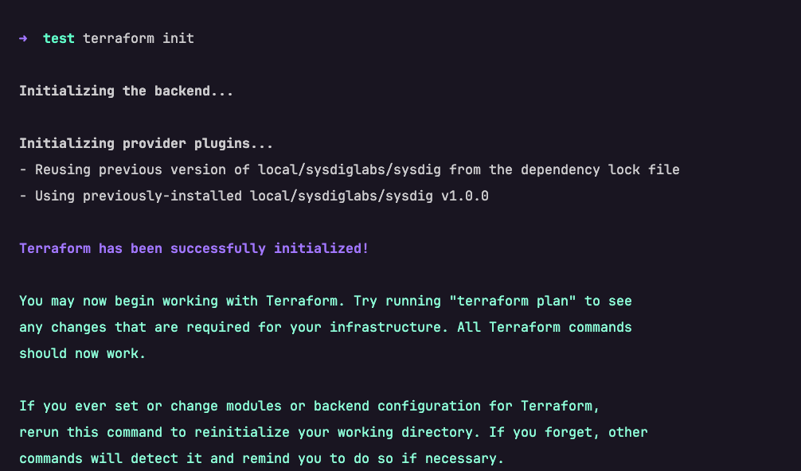

---

copyright:
  years: 2025, 2026
lastupdated: "2026-02-02"

keywords: tags, security and compliance, workload protection, custom profiles

subcollection: workload-protection

---

{{site.data.keyword.attribute-definition-list}}


# Creating custom controls
{: #custom-controls}

With {{site.data.keyword.sysdigsecure_full_notm}}, you can create custom controls that are specific to your organization's needs. Custom controls are policies or rules that give security teams the flexibility to create and enforce policies. You can use them to manage posture, tailor compliance measures, and detect misconfigurations across infrastructures like Kubernetes, Containers, and the cloud. The process of creating custom controls helps you to enhance the flexibility, scalability, and relevance of the security and compliance framework.

{{site.data.keyword.sysdigsecure_short}} posture controls are built on the [Open Policy Agent (OPA)](https://www.openpolicyagent.org/docs) engine, by using the OPA policy language [Rego](https://www.openpolicyagent.org/docs/policy-language). The platform provides access to the code that is used to create these controls and the inputs it evaluates. For more information on testing Rego, see [{{site.data.keyword.sysdigsecure_short}} API](https://cloud.ibm.com/apidocs/workload-protection#test-rego).

## Before you begin
{: #before-you-begin}

You can create custom controls for all services and resources that {{site.data.keyword.sysdigsecure_short}} supports by using API and Terraform. To create custom controls, make sure that you have the following prerequisites:
- [Terraform](https://www.terraform.io/downloads.html) version higher than 0.12.x
- [Go](https://go.dev/doc/install) version higher than the one specified in [go.mod](https://github.com/sysdiglabs/terraform-provider-sysdig/blob/master/go.mod#L3) and [`$GOPATH`](https://go.dev/wiki/SettingGOPATH)
- [Terraform Provider](https://docs.sysdig.com/en/docs/developer-tools/terraform-provider/#create-custom-controls-with-terraform) for {{site.data.keyword.sysdigsecure_full_notm}}.

## Getting a list of services
{: #list-serv}

To get the list of services, you can target in `resourceKind` by using the following example command:

```bash
GET https://<url>/api/cspm/v1/policy/controls/resource-template/kinds
```
{: codeblock}

To view the complete list of resources that are available in the API endpoints, see [Resource kinds](/docs/workload-protection?topic=workload-protection-custom-controls#resource-kind). For more information, see [{{site.data.keyword.sysdigsecure_short}} API](https://cloud.ibm.com/apidocs/workload-protection#get-resource-kinds.)


## Configuring tokens and keys
{: #token-keys}

- Get the [API tokens](/docs/workload-protection?topic=workload-protection-secure_token).

- Replace the Sysdig API tokens in the following code snippet:

```terraform {
   required_providers {
    sysdig = {
      source = "local/sysdiglabs/sysdig"
      version = "~> 1.0.0"
    }
  }
}
provider "sysdig" {
  sysdig_secure_url="https://us-south.security-compliance-secure.cloud.ibm.com"
  sysdig_secure_api_token = "XXXXXXXX-XXXX-XXXX-XXXX-XXXXXXXXXXXXX"
}
```
{: codeblock}

## Creating resources for custom controls
{: #res-cust-control}

{{site.data.keyword.sysdigsecure_short}} uses the `sysdig_secure_posture_control` resource to define custom controls. For more information, see [Creating posture control](https://registry.terraform.io/providers/sysdiglabs/sysdig/latest/docs/resources/secure_posture_control).The following are the resource attributes:
- `name`: The name of the custom control
- `description`: A detailed behaviour of custom control
- `resource_kind`: The type of resource the control applies to (for example, IBM Cloud Internet Services, Kubernetes pods). To create new controls, the `resource_kind` value must be written in lowercase. For example, `resource_kind = "ibm_user-management_user"`.
- `severity`: The severity level (High, Medium, Low) that defines the control's importance
- `rego`: The Rego policy code that defines the control logic
- `remediation_details`: Instructions for remediating any issues identified by the control


### Scenario: DDoS protection is active on {{site.data.keyword.cloud_notm}} internet services
{: #DDos}

DDoS (Distributed Denial of Service) protection is essential because it safeguards your applications, websites, and services from attacks that aim to overwhelm them with massive amounts of traffic. In this scenario, create a custom control to make sure whether the DDoS protection is active for your **IBM Cloud Internet Services**.

1. Download and extract the Git file from the [GitHub repository](https://github.com/sysdiglabs/terraform-provider-sysdig). For more information, see [Sysdig Provider](https://registry.terraform.io/providers/sysdiglabs/sysdig/latest/docs).
1. Create a new Terraform file inside the `terraform-provider-sysdig-master` folder.
1. Copy the following code and paste it in your file. The Rego code is embedded within the Terraform script.
    ```bash
      name          = "Check whether DDoS protection is active on IBM Cloud Internet Services"
      description   = "Ensure DDoS protection is active on IBM Cloud Internet Services"
      resource_kind = "ibm_internet-svcs_zone"
      severity      = "High"

      rego = <<-EOF
      
                package sysdig
                import future.keywords.if
                default risky := false
                risky if {
                    not required_config
                }
                required_config if {
                    has_correct_ddos_enabled_0
                }
                has_correct_ddos_enabled_0 if {
                    input.config.ddos_enabled == true
                }
                has_correct_ddos_enabled_0 if {
                    input.config.ddos_enabled == "true"
                }
      EOF

      remediation_details = <<-EOF
        1. Log in to IBM Cloud.
        2. Click the menu icon and select Resource list.
        3. Select your Cloud Internet Service instance.
        4. Navigate to the Reliability page.
        5. Click the Global Load Balancers tab.
        6. Switch the toggle for the Proxied column to the on position
        7. Click the DNS tab.
        8. Switch the toggle for the Proxied column for the relevant DNS records to the on position.
      EOF
    ```
    {: codeblock}

1. Initialize the Terraform environment from your terminal. If the prerequisites are properly configured, a message similar to the following snapshot is seen.
   {: caption="Terraform environment from your terminal" caption-side="bottom"}
1. To deploy this Terraform script as a custom control in {{site.data.keyword.sysdigsecure_short}}, run `terraform apply` from your terminal.
1. Terraform generates an execution plan that describes the process to deploy the code, and then runs it to build the described infrastructure or configuration.
1. The prompt pauses for user input. At this stage, type `yes` and continue.
1. The custom control `IBM Cloud Internet Services` appears in the **Posture Controls** library and is ready to be used in custom policies.
1. To verify it, log in to {{site.data.keyword.sysdigsecure_short}}, select **Policies > Posture Controls**, and search `IBM Cloud Internet Services`.

## Applying your custom control
{: #apply-cust-control}

You can assign the new custom control to a new or existing {{site.data.keyword.sysdigsecure_short}} posture policy based on your enterprise needs. The following example is created by using these steps:

1. Navigate to **Policies > Posture | Policies**.
1. Select **New Policy**.
1. Configure the policy and click **Save**
   - **Duplicate from**: None. Start from scratch.
   - **Name**: Custom Controls_DDoS protection is active on IBM Cloud Internet Services.
   - **Description**: Add a description.
1. Click **Publish** on the policy details page.
1. {{site.data.keyword.sysdigsecure_short}} prompts you to edit the policy. Alternatively, you can find the policy from the posture policies list, and select **Edit**.
1. In the **Policy Details** tab, select **Add Zones**, and choose the infrastructure scope across which the new control must apply.
1. In the **Requirements & Controls**, link your custom control to evaluate the posture compliance of your defined infrastructure.

To roll back, delete the resource definitions from your Terraform file and reapply. It updates the posture controls library and detaches the defined controls from the policies.

## List of resource Kinds
{: #resource-kind}

The following is the complete list of resource kinds:

| Resource kind | Resource kind | Resource kind | Resource kind |
| -------------- | ------------- | ------------ | --------- |
| AWS_ACCOUNT | AWS_ACCOUNT_PUBLIC_ACCESS_BLOCK_CONFIGURATION | AWS_ACM_CERTIFICATE_SUMMARY | AWS_ANALYZER_SUMMARY | 
| AWS_API_GATEWAY_REST_API | AWS_API_GATEWAY_STAGE | AWS_API_GATEWAY_V2_API | AWS_API_GATEWAY_V2_ROUTE | 
| AWS_API_GATEWAY_V2_STAGE | AWS_APPSYNC_APICACHE | AWS_APPSYNC_GRAPHQLAPI | AWS_AUTOSCALING_AUTOSCALING_GROUP | 
| AWS_AUTOSCALING_LAUNCH_CONFIGURATION | AWS_BACKUP | AWS_BEDROCK_AGENT | AWS_BEDROCK_CUSTOM_MODEL | 
| AWS_BEDROCK_GUARDRAIL | AWS_BEDROCK_KNOWLEDGE_BASE | AWS_CLOUD_TRAIL | AWS_CLOUDFORMATION_STACK | 
| AWS_CLOUDFRONT_DISTRIBUTION | AWS_CLOUDWATCH_LOG_METRIC_FILTER | AWS_CLOUDWATCH_METRIC_ALARM | AWS_CLOUDWATCH_METRICS | 
| AWS_CODEBUILD_PROJECT | AWS_CONFIG_DELIVERY_CHANNEL | AWS_CONFIGURATION_RECORDER | AWS_CONFIGURATION_RECORDER_STATUS | 
| AWS_DATABASE | AWS_DATABASE_CLUSTER | AWS_DATASYNC | AWS_DAX_CLUSTER | 
| AWS_DMS_REPLICATION_INSTANCE | AWS_DYNAMODB_TABLE | AWS_EBS_ENCRYPTION_BY_DEFAULT | AWS_EBS_VOLUME | 
| AWS_EC2_LAUNCH_TEMPLATE | AWS_EC2_NAT_GATEWAY | AWS_EC2_TRANSIT_GATEWAY | AWS_EC2_VPC_PEERING_CONNECTION | 
| AWS_EC2_VPN_CONNECTION | AWS_ECR_REPOSITORY | AWS_ECS_CLUSTER | AWS_ECS_CLUSTER_TASK | 
| AWS_ECS_FARGATE_SERVICE | AWS_ECS_FARGATE_TASK_DEFINITION | AWS_ECS_SERVICE | AWS_ECS_TASK_DEFINITION |
| AWS_EFS_ACCESS_POINT_DESCRIPTION | AWS_EFS_FILE_SYSTEM | AWS_EKS_CLUSTER | AWS_EKS_FARGATE_PROFILE | 
| AWS_EKS_WORKLOAD_DAEMON_SET | AWS_EKS_WORKLOAD_DEPLOYMENT | AWS_EKS_WORKLOAD_POD | AWS_EKS_WORKLOAD_REPLICA_SET |
| AWS_EKS_WORKLOAD_STATEFUL_SET | AWS_ELASTIC_BEANSTALK_CONFIGURATION_SETTINGS | AWS_ELASTIC_BEANSTALK_ENVIRONMENT | AWS_ELASTICACHE_CACHE_CLUSTER | 
| AWS_ELASTICACHE_REPLICATION_GROUP | AWS_ELASTICACHE_RESERVED_CACHE_NODE | AWS_ELASTICSEARCH_DOMAIN | AWS_ELB_LOAD_BALANCER | 
| AWS_ELBV2_LOAD_BALANCER | AWS_EMR_CLUSTER | AWS_FLOW_LOG | AWS_GLUE | 
| AWS_GLUE_DATACATALOG | AWS_GUARDDUTY_DETECTOR | AWS_IAM_ACCESS_KEY | AWS_IAM_GROUP | 
| AWS_IAM_GROUP_DETAIL | AWS_IAM_GROUP_POLICY | AWS_IAM_LOCAL_POLICIES_DETAIL | AWS_IAM_MANAGED_POLICIES_DETAIL | 
| AWS_IAM_ROLE | AWS_IAM_ROLE_DETAIL | AWS_IAM_ROLE_POLICY | AWS_IAM_ROLE_POLICY_RELATION | 
| AWS_IAM_ROLE_RELATION | AWS_IAM_ROLEPOLICY | AWS_IAM_USER_DETAIL | AWS_IAM_USER_POLICY | 
| AWS_INSTANCE | AWS_INTERNET_GATEWAY | AWS_KAFKA_MSK_CLUSTER | AWS_KEY | 
| AWS_KINESIS_STREAM | AWS_KMS_ALIASES | AWS_LAMBDA_FUNCTION | AWS_LAMBDA_FUNCTION_URL_CONFIGURATION | 
| AWS_LAMBDA_POLICY | AWS_MACIE_CLASSIFICATION_JOB | AWS_MQ_BROKER | AWS_MWAAA_ENVIRONMENT | 
| AWS_NETWORK_ACL | AWS_NETWORK_FIREWALL_POLICY | AWS_NETWORK_FIREWALL_RULE_GROUP | AWS_NETWORK_INTERFACE | 
| AWS_OPENSEARCH_DOMAIN | AWS_POLICY | AWS_QUICKSIGHT | AWS_RAM | 
| AWS_RDS_CLUSTER_PARAMETERSGROUP | AWS_RDS_DB_SNAPSHOT | AWS_RDS_EVENT_SUBSCRIPTION | AWS_RDS_PARAMETERSGROUP | 
| AWS_RDS_RESERVED_INSTANCE | AWS_RECORDER | AWS_REDSHIFT_CLUSTER | AWS_REDSHIFT_CLUSTER_PARAMETERS | 
| AWS_REDSHIFT_COVERAGE | AWS_REDSHIFT_RESERVED_NODE | AWS_REGION | AWS_REST_API_GATEWAY_DOMAIN_NAME | 
| AWS_REST_API_GATEWAY_RESOURCE | AWS_REST_API_GATEWAY_RESOURCE_METHOD | AWS_ROOT_USER | AWS_ROUTE_TABLE | 
| AWS_S3_BUCKET | AWS_S3_BUCKET_ACCELERATE | AWS_S3_BUCKET_ACL | AWS_S3_BUCKET_LIFECYCLE | 
| AWS_S3_BUCKET_LOGGING | AWS_S3_BUCKET_OWNERSHIP_CONTROLS | AWS_S3_BUCKET_POLICY | AWS_S3_BUCKET_POLICY_STATUS |
| AWS_S3_BUCKET_SERVER_SIDE_ENCRYPTION_CONFIGURATION | AWS_S3_BUCKET_WEBSITE | AWS_S3_OBJECT_LOCK | AWS_S3_PUBLIC_ACCESS_BLOCK_CONFIGURATION | 
| AWS_S3_VERSIONING_CONFIGURATION | AWS_SAGEMAKER_NOTEBOOK_INSTANCE | AWS_SECRETMANAGER_LIST_SECRET | AWS_SECURITY_GROUP | 
| AWS_SECURITY_GROUP_RULE | AWS_SERVER_CERTIFICATE | AWS_SERVICE_CONTROL_POLICY | AWS_SNS_TOPIC | 
| AWS_SNS_TOPIC_SUBSCRIPTION | AWS_SQS_QUEUE | AWS_SSM_ASSOCIATION_DESCRIPTION | AWS_SSM_DOCUMENT | 
| AWS_SSM_INSTANCE_PATCH | AWS_SUBNET | AWS_TRAFFIC_MIRROR_SESSION | AWS_TRANSFER_SERVER | 
| AWS_USER | AWS_USER_INLINE_POLICY | AWS_VPC | AWS_WAF_REGIONAL_RULE | 
| AWS_WAF_REGIONAL_RULE_GROUP | AWS_WAF_REGIONAL_WEBACL | AWS_WAF_RULE | AWS_WAF_RULE_GROUP | 
| AWS_WAF_V2_LOGGING_CONFIGURATION | AWS_WAF_V2_WEBACL | AWS_WAF_WEB_ACL | |
{: caption="AWS resource kinds" caption-side="bottom"}
{: #aws}
{: tab-title="AWS"}
{: tab-group="Resource-kinds"}
{: class="simple-tab-table"}
{: row-headers}


| Resource kind | Resource kind | Resource kind | Resource kind |
| -------------- | ------------- | ------------ | --------- |
| AZURE_MICROSOFT_APP_CONTAINERAPPS | AZURE_MICROSOFT_APP_JOBS | AZURE_MICROSOFT_AUTHORIZATION_POLICYASSIGNMENTS | AZURE_MICROSOFT_AUTHORIZATION_POLICYDEFINITIONS | 
| AZURE_MICROSOFT_AUTHORIZATION_ROLEASSIGNMENTS | AZURE_MICROSOFT_WEB_SITES | AZURE_MICROSOFT_WEB_SITES_CONFIG | AZURE_MICROSOFT_WEB_SITES_CONFIG_APPSETTINGS | 
| AZURE_MICROSOFT_AUTHORIZATION_ROLEDEFINITIONS | AZURE_MICROSOFT_CACHE_REDIS | AZURE_MICROSOFT_CACHE_REDIS_ENTERPRISE | AZURE_MICROSOFT_COMPUTE_DISKENCRYPTIONSETS | 
| AZURE_MICROSOFT_COMPUTE_DISKS | AZURE_MICROSOFT_COMPUTE_GALLERIES_IMAGES | AZURE_MICROSOFT_COMPUTE_SNAPSHOTS | AZURE_MICROSOFT_COMPUTE_SSHPUBLICKEYS | 
| AZURE_MICROSOFT_COMPUTE_VIRTUALMACHINES | AZURE_MICROSOFT_COMPUTE_VIRTUALMACHINES_EXTENSIONS | AZURE_MICROSOFT_CONTAINERINSTANCE_CONTAINERGROUPS | AZURE_MICROSOFT_CONTAINERSERVICE_MANAGEDCLUSTERS | 
| AZURE_MICROSOFT_CONTAINERSERVICE_MANAGEDCLUSTERS_UPGRADEPROFILES | AZURE_MICROSOFT_DBFORMYSQL_FLEXIBLESERVERS_CONFIGURATIONS | AZURE_MICROSOFT_DBFORPOSTGRESQL_SERVERS | AZURE_MICROSOFT_DBFORPOSTGRESQL_SERVERS_CONFIGURATIONS | 
| AZURE_MICROSOFT_DBFORPOSTGRESQL_SERVERS_FIREWALLRULES | AZURE_MICROSOFT_EVENTHUB_NAMESPACES | AZURE_MICROSOFT_GROUP | AZURE_MICROSOFT_INSIGHTS_ACTIONGROUPS | 
| AZURE_MICROSOFT_INSIGHTS_ACTIVITYLOGALERTS | AZURE_MICROSOFT_INSIGHTS_DIAGNOSTICSETTINGS | AZURE_MICROSOFT_KEYVAULT_VAULTS | AZURE_MICROSOFT_KEYVAULT_VAULTS_KEYS | 
| AZURE_MICROSOFT_KEYVAULT_VAULTS_SECRETS | AZURE_MICROSOFT_LOCATIONS | AZURE_MICROSOFT_MANAGEDIDENTITY_USERASSIGNEDIDENTITIES | AZURE_MICROSOFT_NETWORK_LOADBALANCERS | 
| AZURE_MICROSOFT_NETWORK_NETWORKINTERFACES | AZURE_MICROSOFT_NETWORK_NETWORKSECURITYGROUPS | AZURE_MICROSOFT_NETWORK_NETWORKWATCHERS | AZURE_MICROSOFT_NETWORK_NETWORKWATCHERS_FLOWLOGS | 
| AZURE_MICROSOFT_NETWORK_PUBLICIPADDRESSES | AZURE_MICROSOFT_NETWORK_ROUTETABLES | AZURE_MICROSOFT_NETWORK_VIRTUALNETWORKS | AZURE_MICROSOFT_OPERATIONALINSIGHTS_WORKSPACES | 
| AZURE_MICROSOFT_OPERATIONALINSIGHTS_WORKSPACES_DATAEXPORTS | AZURE_MICROSOFT_OPERATIONSMANAGEMENT_SOLUTIONS | AZURE_MICROSOFT_RECOVERYSERVICES_VAULTS | AZURE_MICROSOFT_RECOVERYSERVICES_VAULTS_BACKUPJOBS | 
| AZURE_MICROSOFT_RESOURCES_RESOURCEGROUPS | AZURE_MICROSOFT_SECURITY_AUTOPROVISIONINGSETTINGS | AZURE_MICROSOFT_SECURITY_PRICINGS | AZURE_MICROSOFT_SECURITY_SETTINGS | 
| AZURE_MICROSOFT_SERVICEPRINCIPAL | AZURE_MICROSOFT_SQL_SERVERS | AZURE_MICROSOFT_SQL_SERVERS_ADADMINS | AZURE_MICROSOFT_SQL_SERVERS_ADVANCEDTHREATPROTECTIONSETTINGS | 
| AZURE_MICROSOFT_SQL_SERVERS_AUDITINGSETTINGS | AZURE_MICROSOFT_SQL_SERVERS_DATABASES | AZURE_MICROSOFT_SQL_SERVERS_DATABASES_TRANSPARENTDATAENCRYPTION | AZURE_MICROSOFT_SQL_SERVERS_ENCRYPTIONPROTECTOR | 
| AZURE_MICROSOFT_SQL_SERVERS_FIREWALLRULES | AZURE_MICROSOFT_SQL_SERVERS_VULNERABILITYASSESSMENTS | AZURE_MICROSOFT_STORAGE_STORAGEACCOUNTS | AZURE_MICROSOFT_STORAGE_STORAGEACCOUNTS_ACCESSPOLICIES | 
| AZURE_MICROSOFT_STORAGE_STORAGEACCOUNTS_BLOBSERVICES | AZURE_MICROSOFT_STORAGE_STORAGEACCOUNTS_BLOBSERVICES_CONTAINERS | AZURE_MICROSOFT_STORAGE_STORAGEACCOUNTS_BLOBSERVICESPROPERTIES | AZURE_MICROSOFT_STORAGE_STORAGEACCOUNTS_ENCRYPTIONSCOPES | 
| AZURE_MICROSOFT_STORAGE_STORAGEACCOUNTS_FILESERVICESPROPERTIES | AZURE_MICROSOFT_STORAGE_STORAGEACCOUNTS_MANAGEMENTPOLICIES | AZURE_MICROSOFT_STORAGE_STORAGEACCOUNTS_QUEUESERVICESPROPERTIES | AZURE_MICROSOFT_STORAGE_STORAGEACCOUNTS_TABLESERVICESPROPERTIES | 
| AZURE_MICROSOFT_STREAMANALYTICS_STREAMINGJOBS | AZURE_MICROSOFT_SUBSCRIPTION | AZURE_MICROSOFT_USER | AZURE_MICROSOFT_WEB_SERVERFARMS | 
{: caption="Azure resource kinds" caption-side="bottom"}
{: #azure}
{: tab-title="AZURE"}
{: tab-group="Resource-kinds"}
{: class="simple-tab-table"}
{: row-headers}

| Resource kind | Resource kind | Resource kind | Resource kind |
| --------------- | ------------- | ------------ | --------- | 
| GCP_APIKEYS_GOOGLEAPIS_COM_KEY | GCP_APPENGINE_GOOGLEAPIS_COM_APPLICATION | GCP_ARTIFACTREGISTRY_GOOGLEAPIS_COM_DOCKERIMAGE | GCP_ARTIFACTREGISTRY_GOOGLEAPIS_COM_REPOSITORY | 
| GCP_BIGQUERY_GOOGLEAPIS_COM_DATASET | GCP_BIGQUERY_GOOGLEAPIS_COM_DATASET_IAM_POLICY | GCP_BIGQUERY_GOOGLEAPIS_COM_TABLE | GCP_CLOUDBILLING_GOOGLEAPIS_COM_PROJECTBILLINGINFO | 
| GCP_CLOUDBUILD_GOOGLEAPIS_COM_BUILD | GCP_CLOUDFUNCTIONS_GOOGLEAPIS_COM_CLOUDFUNCTION | GCP_CLOUDFUNCTIONS_GOOGLEAPIS_COM_FUNCTION | GCP_CLOUDKMS_GOOGLEAPIS_COM_CRYPTOKEY | 
| GCP_CLOUDKMS_GOOGLEAPIS_COM_CRYPTOKEY_IAM_POLICY | GCP_CLOUDKMS_GOOGLEAPIS_COM_CRYPTOKEYVERSION | GCP_CLOUDKMS_GOOGLEAPIS_COM_KEYRING | GCP_CLOUDRESOURCEMANAGER_GOOGLEAPIS_COM_ORGANIZATION | 
| GCP_CLOUDRESOURCEMANAGER_GOOGLEAPIS_COM_PROJECT | GCP_CLOUDRESOURCEMANAGER_GOOGLEAPIS_COM_PROJECT_IAM_POLICY | GCP_CLOUDRESOURCEMANAGER_GOOGLEAPIS_COM_TAGKEY | GCP_CLOUDRESOURCEMANAGER_GOOGLEAPIS_COM_TAGVALUE | 
| GCP_COMPUTE_GOOGLEAPIS_COM_ADDRESS | GCP_COMPUTE_GOOGLEAPIS_COM_BACKENDBUCKET | GCP_COMPUTE_GOOGLEAPIS_COM_DISK | GCP_COMPUTE_GOOGLEAPIS_COM_FIREWALL | 
| GCP_COMPUTE_GOOGLEAPIS_COM_FIREWALLEFFECTIVERULES | GCP_COMPUTE_GOOGLEAPIS_COM_FIREWALLPOLICY | GCP_COMPUTE_GOOGLEAPIS_COM_GLOBALADDRESS | GCP_COMPUTE_GOOGLEAPIS_COM_GLOBALFORWARDINGRULE | 
| GCP_COMPUTE_GOOGLEAPIS_COM_HEALTHCHECK | GCP_COMPUTE_GOOGLEAPIS_COM_IMAGE | GCP_COMPUTE_GOOGLEAPIS_COM_IMAGE_IAM_POLICY | GCP_COMPUTE_GOOGLEAPIS_COM_INSTANCE | 
| GCP_COMPUTE_GOOGLEAPIS_COM_INSTANCEGROUP | GCP_COMPUTE_GOOGLEAPIS_COM_INSTANCEGROUPMANAGER | GCP_COMPUTE_GOOGLEAPIS_COM_INSTANCETEMPLATE | GCP_COMPUTE_GOOGLEAPIS_COM_NETWORK | 
| GCP_COMPUTE_GOOGLEAPIS_COM_NETWORKENDPOINTGROUP | GCP_COMPUTE_GOOGLEAPIS_COM_NETWORKINTERFACE | GCP_COMPUTE_GOOGLEAPIS_COM_PROJECT | GCP_COMPUTE_GOOGLEAPIS_COM_REGIONBACKENDSERVICE | 
| GCP_COMPUTE_GOOGLEAPIS_COM_RESOURCEPOLICY | GCP_COMPUTE_GOOGLEAPIS_COM_ROUTE | GCP_COMPUTE_GOOGLEAPIS_COM_ROUTER | GCP_COMPUTE_GOOGLEAPIS_COM_SECURITYPOLICY | 
| GCP_COMPUTE_GOOGLEAPIS_COM_SNAPSHOT | GCP_COMPUTE_GOOGLEAPIS_COM_SSLCERTIFICATE | GCP_COMPUTE_GOOGLEAPIS_COM_SSLPOLICY | GCP_COMPUTE_GOOGLEAPIS_COM_SUBNETWORK | 
| GCP_COMPUTE_GOOGLEAPIS_COM_TARGETHTTPPROXY | GCP_COMPUTE_GOOGLEAPIS_COM_TARGETHTTPSPROXY | GCP_COMPUTE_GOOGLEAPIS_COM_URLMAP | GCP_CONTAINER_GOOGLEAPIS_COM_CLUSTER | 
| GCP_CONTAINER_GOOGLEAPIS_COM_NODEPOOL | GCP_CONTAINERREGISTRY_GOOGLEAPIS_COM_IMAGE | GCP_DNS_GOOGLEAPIS_COM_MANAGEDZONE | GCP_DNS_GOOGLEAPIS_COM_POLICY | 
| GCP_EVENTARC_GOOGLEAPIS_COM_TRIGGER | GCP_FIRESTORE_GOOGLEAPIS_COM_DATABASE | GCP_GOOGLE_IAM_SERVICEACCOUNT_INSIGHT | GCP_IAM_GOOGLEAPIS_COM_GROUP | 
| GCP_IAM_GOOGLEAPIS_COM_ROLE | GCP_IAM_GOOGLEAPIS_COM_SERVICEACCOUNT | GCP_IAM_GOOGLEAPIS_COM_SERVICEACCOUNTKEY | GCP_IAM_GOOGLEAPIS_COM_USER | 
| GCP_LOGGING_GOOGLEAPIS_COM_LOGBUCKET | GCP_LOGGING_GOOGLEAPIS_COM_LOGMETRIC | GCP_LOGGING_GOOGLEAPIS_COM_LOGSINK | GCP_MONITORING_GOOGLEAPIS_COM_ALERTPOLICY | 
| GCP_NETWORKMANAGEMENT_GOOGLEAPIS_COM_CONNECTIVITYTEST | GCP_OSCONFIG_GOOGLEAPIS_COM_OSPOLICYASSIGNMENT | GCP_OSCONFIG_GOOGLEAPIS_COM_OSPOLICYASSIGNMENTREPORT | GCP_PUBSUB_GOOGLEAPIS_COM_SUBSCRIPTION | 
| GCP_PUBSUB_GOOGLEAPIS_COM_SUBSCRIPTION_IAM_POLICY | GCP_PUBSUB_GOOGLEAPIS_COM_TOPIC | GCP_PUBSUB_GOOGLEAPIS_COM_TOPIC_IAM_POLICY | GCP_RUN_GOOGLEAPIS_COM_EXECUTION | 
| GCP_RUN_GOOGLEAPIS_COM_JOB | GCP_RUN_GOOGLEAPIS_COM_REVISION | GCP_RUN_GOOGLEAPIS_COM_SERVICE | GCP_SECRETMANAGER_GOOGLEAPIS_COM_SECRET | 
| GCP_SECRETMANAGER_GOOGLEAPIS_COM_SECRETVERSION | GCP_SERVICEDIRECTORY_GOOGLEAPIS_COM_ENDPOINT | GCP_SERVICEDIRECTORY_GOOGLEAPIS_COM_NAMESPACE | GCP_SERVICEDIRECTORY_GOOGLEAPIS_COM_SERVICE | 
| GCP_SERVICEUSAGE_GOOGLEAPIS_COM_SERVICE | GCP_SQLADMIN_GOOGLEAPIS_COM_BACKUPRUN | GCP_SQLADMIN_GOOGLEAPIS_COM_INSTANCE | GCP_STORAGE_GOOGLEAPIS_COM_BUCKET | 
| GCP_STORAGE_GOOGLEAPIS_COM_BUCKET_IAM_POLICY |
{: caption="GCP resource kinds" caption-side="bottom"}
{: #gcp}
{: tab-title="GCP"}
{: tab-group="Resource-kinds"}
{: class="simple-tab-table"}
{: row-headers}


| Resource kind | Resource kind | Resource kind | Resource kind |
| --------------- | ------------- | ------------ | --------- |  
| IBM_APPID_CLOUD-DIRECTORY-ADVANCED-PASSWORD-POLICY | IBM_APPID_CLOUD-DIRECTORY-CONFIGURATION | IBM_USER-MANAGEMENT_SERVICE | IBM_USER-MANAGEMENT_USER | 
| IBM_APPID_CLOUD-DIRECTORY-CUSTOM-EMAIL-DISPATCHER-CONFIGURATION | IBM_APPID_INSTANCE | IBM_APPID_REDIRECT-URI | IBM_APPRAPP_INSTANCE | 
| IBM_ATRACKER_ROUTE | IBM_ATRACKER_SERVICE | IBM_ATRACKER_TARGET | IBM_BILLING_ACCOUNT-TRAIT | 
| IBM_CLOUD-OBJECT-STORAGE_BUCKET | IBM_CLOUDANTNOSQLDB_INSTANCE | IBM_CLOUDSHELL_ACCOUNT-SETTINGS | IBM_CODEENGINE_PROJECT |
| IBM_COMPLIANCE_INSTANCE | IBM_CONTAINER-REGISTRY_IMAGE | IBM_CONTAINER-REGISTRY_NAMESPACE | IBM_CONTAINER-REGISTRY_SERVICE | 
| IBM_CONTAINERS-KUBERNETES_INSTANCE | IBM_CONTAINERS-KUBERNETES_OPENSHIFT-CLUSTER | IBM_CONTAINERS-KUBERNETES_SECRET | IBM_CONTAINERS-KUBERNETES_WORKER | 
| IBM_DATABASES-FOR-ELASTICSEARCH_INSTANCE | IBM_DATABASES-FOR-ENTERPRISEDB_INSTANCE | IBM_DATABASES-FOR-ETCD_INSTANCE | IBM_DATABASES-FOR-MONGODB_INSTANCE | 
| IBM_DATABASES-FOR-MYSQL_INSTANCE | IBM_DATABASES-FOR-POSTGRESQL_INSTANCE | IBM_DATABASES-FOR-REDIS_INSTANCE | IBM_DIRECTLINK_INSTANCE | 
| IBM_DIRECTLINK_SERVICE | IBM_DNS-SVCS_INSTANCE | IBM_EVENT-NOTIFICATIONS_INSTANCE | IBM_EVENT-NOTIFICATIONS_SOURCE |
| IBM_GLOBALCATALOG-COLLECTION_ACCOUNT-SETTINGS | IBM_HS-CRYPTO_INSTANCE | IBM_HS-CRYPTO_KEY | IBM_HYPERP-DBAAS-MONGODB_INSTANCE | 
| IBM_HYPERP-DBAAS-POSTGRESQL_INSTANCE | IBM_IAM-ACCESS-MANAGEMENT_SERVICE | IBM_IAM-GROUPS_SERVICE | IBM_IAM-IDENTITY_ACCOUNTSETTINGS | 
| IBM_IAM-IDENTITY_APIKEY | IBM_IAM-IDENTITY_CBR-RESOURCE | IBM_IAM-IDENTITY_GLOBALCATALOG-RESOURCE | IBM_IAM-IDENTITY_SERVICE |
| IBM_IAM-IDENTITY_SERVICEID | IBM_INTERNET-SVCS_ZONE | IBM_IS_BACKUP-POLICY_INSTANCE | IBM_IS_BARE-METAL-SERVER_INSTANCE |
| IBM_IS_DEDICATED-HOST_INSTANCE | IBM_IS_ENDPOINT-GATEWAY_INSTANCE | IBM_IS_FLOATING-IP_INSTANCE | IBM_IS_FLOW-LOG-COLLECTOR_INSTANCE | 
| IBM_IS_IMAGE_INSTANCE | IBM_IS_INSTANCE-GROUP_INSTANCE | IBM_IS_INSTANCE_IMAGE | IBM_IS_INSTANCE_INSTANCE | 
| IBM_IS_INSTANCE_VOLUME | IBM_IS_KEY_INSTANCE | IBM_IS_LOAD-BALANCER_INSTANCE | IBM_IS_LOAD-BALANCER_LISTENER-POLICY | 
| IBM_IS_LOAD-BALANCER_LISTENER | IBM_IS_LOAD-BALANCER_POOL | IBM_IS_NETWORK-ACL_INSTANCE | IBM_IS_NETWORK-ACL_RULE | 
| IBM_IS_PLACEMENT-GROUP_INSTANCE | IBM_IS_PUBLIC-GATEWAY_INSTANCE | IBM_IS_SECURITY-GROUP_INSTANCE | IBM_IS_SECURITY-GROUP_RULE |
| IBM_IS_SECURITY-GROUP_RULE_RELATION | IBM_IS_SHARE_INSTANCE | IBM_IS_SNAPSHOT_INSTANCE | IBM_IS_SUBNET_INSTANCE | 
| IBM_IS_VOLUME_INSTANCE | IBM_IS_VPC_INSTANCE | IBM_IS_VPC_SERVICE | IBM_IS_VPN-SERVER_INSTANCE | 
| IBM_IS_VPN_CONNECTION | IBM_IS_VPN_INSTANCE | IBM_IS_VPN_SERVICE | IBM_KMS_INSTANCE | 
| IBM_KMS_KEY | IBM_LOCATION | IBM_LOGDNA_INSTANCE | IBM_LOGDNA_SERVICE | 
| IBM_LOGDNAAT_INSTANCE | IBM_LOGDNAAT_INSTANCE_RELATION | IBM_LOGDNAAT_SERVICE | IBM_LOGS-ROUTER_TENANT | 
| IBM_LOGS_ALERT | IBM_LOGS_DATA_ACCESS_RULE | IBM_LOGS_DATA_USAGE_METRICS | IBM_LOGS_ENRICHMENT | 
| IBM_LOGS_EVENTS_TO_METRICS | IBM_LOGS_INSTANCE | IBM_LOGS_OUTGOING_WEBHOOK | IBM_LOGS_POLICY | 
| IBM_LOGS_RULE_GROUP | IBM_LOGS_STREAM | IBM_LOGS_VIEW | IBM_MESSAGEHUB_INSTANCE | 
| IBM_MESSAGES-FOR-RABBITMQ_INSTANCE | IBM_PM-20_INSTANCE | IBM_PM-20_PROJECT | IBM_PM-20_SERVICE | 
| IBM_POWER-IAAS.NETWORK-ADDRESS-GROUP_INSTANCE | IBM_POWER-IAAS.VOLUME_INSTANCE | IBM_POWER-IAAS_NETWORK-ADDRESS-GROUP_INSTANCE | IBM_POWER-IAAS_NETWORK-INTERFACE_INSTANCE | 
| IBM_POWER-IAAS_NETWORK-SECURITY-GROUP_INSTANCE | IBM_POWER-IAAS_NETWORK-SECURITY-GROUP_INSTANCE_RELATION | IBM_POWER-IAAS_NETWORK_INSTANCE | IBM_POWER-IAAS_PVM-INSTANCE_INSTANCE | 
| IBM_POWER-IAAS_WORKSPACE | IBM_PROJECT_INSTANCE | IBM_SCHEMATICS_INSTANCE | IBM_SECRETS-MANAGER_INSTANCE |
| IBM_SECRETS-MANAGER_SECRET-GROUP | IBM_SECRETS-MANAGER_SECRET | IBM_SYSDIG-MONITOR_INSTANCE | IBM_SYSDIG-SECURE_INSTANCE |
| IBM_TOOLCHAIN_INSTANCE | IBM_TRANSIT_INSTANCE | IBM_TRANSIT_SERVICE | IBM_USER-MANAGEMENT_OWNER |  
{: caption="IBM resource kinds" caption-side="bottom"}
{: #ibm}
{: tab-title="IBM"}
{: tab-group="Resource-kinds"}
{: class="simple-tab-table"}
{: row-headers}

| Resource kind | Resource kind | Resource kind | Resource kind |
| --------------- | ------------- | ------------ |--------- |
| CLUSTERROLE | CLUSTERROLEBINDING | CRONJOB | DAEMONSET | 
| DEPLOYMENT | GROUP | INGRESS | JOB | 
| NAMESPACE | NETWORKPOLICY | REPLICASET | ROLE | 
| ROLEBINDING | SECRET | SERVICE | SERVICEACCOUNT | 
| STATEFULSET | USER | | |
{: caption="Other resource kinds" caption-side="bottom"}
{: #other}
{: tab-title="OTHER"}
{: tab-group="Resource-kinds"}
{: class="simple-tab-table"}
{: row-headers}


