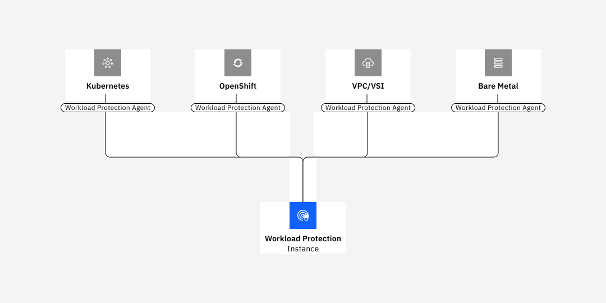

---

copyright:
  years:  2023, 2024
lastupdated: "2024-04-18"

keywords:

subcollection: workload-protection

---

{{site.data.keyword.attribute-definition-list}}

# Getting started with {{site.data.keyword.sysdigsecure_full_notm}}
{: #getting-started}

In architectures that are focused on container and microservices, you can use {{site.data.keyword.sysdigsecure_full}} to find and prioritize software vulnerabilities, detect and respond to threats, and manage configurations, permissions, and compliance from source to run.
{: shortdesc}

## Before you begin
{: #getting-started-prereqs}

- You must have a user ID that is a member or an owner of an {{site.data.keyword.cloud_notm}} account. To get an {{site.data.keyword.cloud_notm}} user ID, go to: [Registration](https://cloud.ibm.com/login){: external}.

- Check the regions where the service is available. [Learn more](/docs/workload-protection?topic=workload-protection-regions). You can complete the steps in any of the supported regions.

## Step 1. Manage user access
{: #getting-started-step1}

Every user that accesses the {{site.data.keyword.sysdigsecure_full_notm}} service in your account must be assigned an access policy with an IAM user role defined. The policy determines the actions that the user can run within the context of the service or instance you selected. The allowable actions are customized and defined as operations that are allowed to be run on the service. The actions are then mapped to IAM user roles. For more information, see [Managing user access in the {{site.data.keyword.cloud_notm}}](/docs/workload-protection?topic=workload-protection-iam).

When a user is granted permissions in the {{site.data.keyword.cloud_notm}} to work with the {{site.data.keyword.sysdigsecure_full_notm}} service, the user is automatically granted a service role. This role determines the actions that a user has permissions to run. For more information, see [Controlling access through IAM](/docs/workload-protection?topic=workload-protection-iam).

Before you can provision an instance, you need to understand:
* The account owner can create, view, and delete an instance of a service in the {{site.data.keyword.cloud_notm}}, and can grant permissions to other users to work with the {{site.data.keyword.sysdigsecure_full_notm}} service.
* You must have permissions to create resources in the *Default* resource group.
* Other {{site.data.keyword.cloud_notm}} users with `administrator` or `editor` permissions can manage the {{site.data.keyword.sysdigsecure_full_notm}} service in the {{site.data.keyword.cloud_notm}}. These users must also have platform permissions to create resources within the context of the resource group where they plan to provision the instance.

To grant a user the administrator role for the service and to manage instances within a resource group in the account, the user must have an IAM policy for the {{site.data.keyword.sysdigsecure_full_notm}} service. For more information, see [Granting permissions to work with the {{site.data.keyword.sysdigsecure_full_notm}} service](/docs/workload-protection?topic=workload-protection-iam).

By default, users are automatically added as members of the **Secure Operations** team that is predefined for each {{site.data.keyword.sysdigsecure_full_notm}} instance. Users have full permissions to see all the data in the web UI.

## Step 2. Provision an instance
{: #getting-started-step2}

To add monitoring features with {{site.data.keyword.sysdigsecure_full_notm}} in the {{site.data.keyword.cloud_notm}}, you must provision an instance of the {{site.data.keyword.sysdigsecure_full_notm}} service.

Instances are provisioned in the context of a resource group. A resource group organizes your services for access control and billing purposes. You can provision the {{site.data.keyword.sysdigsecure_full_notm}} instance in the *default* resource group or in a custom resource group.

To provision an instance through the {{site.data.keyword.cloud_notm}} UI, complete the following steps:

1. Log in to your {{site.data.keyword.cloud_notm}} account.

   Open the [{{site.data.keyword.cloud_notm}} dashboard](https://cloud.ibm.com/login){: external}.

   After you log in with your user ID and password, the {{site.data.keyword.cloud_notm}} UI opens.

2. Click **Catalog**. The list of the services that are available in {{site.data.keyword.cloud_notm}} opens.

3. To filter the list of services that is displayed, select the **Security** category.

4. Click the **{{site.data.keyword.sysdigsecure_full_notm}}** tile.

5. Select the location.

6. Select a service plan.

   For more information about the service plans, see [Service plans](/docs/workload-protection?topic=workload-protection-pricing).

7. Enter a service name.

8. Select a resource group. By default, the **Default** resource group is set.

9. Click **Create** to provision an instance.

The service UI opens.

To provision an instance through the CLI, see [Provisioning a Monitoring instance through the {{site.data.keyword.cloud_notm}} CLI](/docs/workload-protection?topic=workload-protection-provision#provision_cli).
{: tip}

## Step 3. Connect a data source by configuring an agent
{: #getting-started-secure-step3}

After you provision an instance of the {{site.data.keyword.sysdigsecure_full_notm}} service in the {{site.data.keyword.cloud_notm}}, you can deploy the agent on your cluster. The agent collects data that you can use for intrusion detection, posture management, vulnerability scanning, and incident response capabilities.

{: caption="Agents that can be configured to provide data to {{site.data.keyword.sysdigsecure_full_notm}}" caption-side="bottom"}

Choose 1 of the following options:
1. [Configure an agent for Kubernetes](/docs/workload-protection?topic=workload-protection-agent-deploy-kube-helm).
2. [Configure an agent for {{site.data.keyword.redhat_openshift_notm}}](/docs/workload-protection?topic=workload-protection-agent-deploy-openshift-helm).

## Step 4. Launch the web UI
{: #getting-started-step4}

After you provision an instance of the {{site.data.keyword.sysdigsecure_full_notm}} service, and configure a monitoring agent for your node, you can view, monitor, and manage data through the service's web UI.

You launch the web UI within the context of the {{site.data.keyword.sysdigsecure_full_notm}} instance, from the {{site.data.keyword.cloud_notm}} UI.

Complete the following steps to launch the monitoring UI:

1. Log in to your {{site.data.keyword.cloud_notm}} account.

    Click [{{site.data.keyword.cloud_notm}} dashboard](https://cloud.ibm.com/login){: external} to launch the {{site.data.keyword.cloud_notm}} dashboard.

	After you log in with your user ID and password, the {{site.data.keyword.cloud_notm}} Dashboard opens.

2. In the navigation menu, select **Resource List**.

3. Select **Security**.

    The list of instances that are available on {{site.data.keyword.cloud_notm}} is displayed.

4. Select one instance. Then, click **Open dashboard**.

    The Web UI opens.

## Step 5. Secure your environment
{: #getting-started-secure-step5}

See the following table for tasks that you can run to secure your environment:

| Action                              | Description                  |
|-------------------------------------|------------------------------|
| [Integrate scanning into your CI/CD Pipeline](https://docs.sysdig.com/en/docs/sysdig-secure/vulnerabilities/pipeline/){: external} | You can integrate scanning into your CI/CD Pipeline to analyze images that are available on the CI/CD worker nodes. |
| [Configure a notification channel](/docs/workload-protection?topic=workload-protection-notifications#notifications_create) | You can configure a notification channel to get notified about events, anomalies, or security incidents that require attention. |
| [Scan container images](/docs/workload-protection?topic=workload-protection-pipeline)             | You can scan container images for vulnerabilities, and other violations.  |
| [Configure a rule](/docs/workload-protection?topic=workload-protection-manage_rules)                  | You can create a `Detection Rule` to detect and respond to anomalous runtime activity.  \n You can create a rule to specify which image versions can be used. |
| [Review your Compliance results](https://docs.sysdig.com/en/docs/sysdig-secure/posture/compliance/){: external}        | The Compliance module relies on persisting the resources in an inventory; this enhanced resource visibility and full-context prioritization drives remediation and resolution of violations.|
{: caption="Tasks to secure your environment" caption-side="bottom"}

## Next steps
{: #getting-started-secure-next-step}

To get the most out of {{site.data.keyword.sysdigsecure_short}}, connect your instance to {{site.data.keyword.compliance_short}}. By creating a connection, you can view all of the compliance results that are returned by {{site.data.keyword.sysdigsecure_short}}, but you can validate and view your I{{site.data.keyword.cloud_notm}} results all in the same place. For more information, check out [Connecting Workload Protection](/docs/security-compliance?topic=security-compliance-setup-workload-protection).
