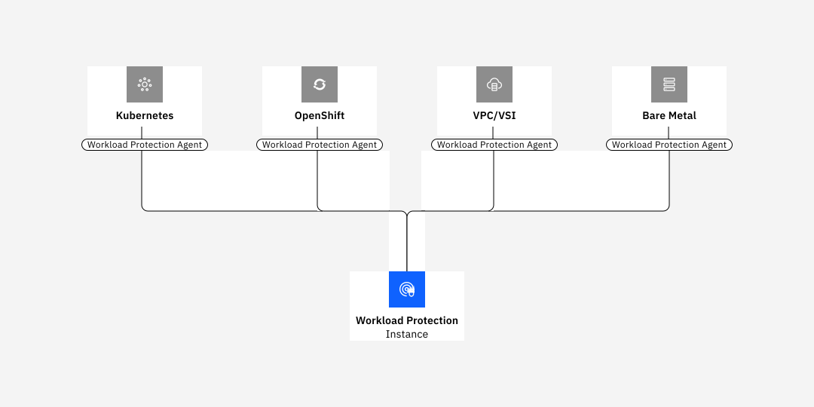

---

copyright:
  years: 2023, 2026
lastupdated: "2026-06-18"

keywords: compliance scanning, security, vulnerability scanning, threat detection

subcollection: workload-protection

content-type: tutorial
services: workload-protection
account-plan: paid
completion-time: 30m

---

{{site.data.keyword.attribute-definition-list}}

# Getting started with {{site.data.keyword.sysdigsecure_full_notm}}
{: #getting-started}
{: toc-content-type="tutorial"}
{: toc-services="workload-protection"}
{: toc-completion-time="30m"}

Start with {{site.data.keyword.sysdigsecure_full}} to establish a strong security foundation across hybrid multicloud and on-premises environments, including AI workloads. With cloud-native application protection platform (CNAPP) capabilities, you can assess risk, prioritize vulnerabilities, detect threats, and consistently manage security and compliance across the application lifecycle.
{: shortdesc}

{{site.data.keyword.sysdigsecure_short}} uses functionality from Sysdig Secure. You might see links to [Sysdig Secure documentation](https://docs.sysdig.com/en/docs/sysdig-secure/){: external} throughout this content because that information also applies to {{site.data.keyword.sysdigsecure_short}}.
{: note}

## Before you begin
{: #prereqs}

Before you can set up a {{site.data.keyword.sysdigsecure_short}} instance, make sure that you have access to create resources in a resource group.

The {{site.data.keyword.cloud_notm}} account owner can create, view, and delete an instance of a service, and can grant access to other users to work with the {{site.data.keyword.sysdigsecure_full_notm}} service. Other {{site.data.keyword.cloud_notm}} users with administrator or editor roles can manage the {{site.data.keyword.sysdigsecure_short}} service. For more information about managing access, see [Managing IAM access for {{site.data.keyword.sysdigsecure_short}}](/docs/workload-protection?topic=workload-protection-iam) and [Managing user access in {{site.data.keyword.cloud_notm}}](/docs/account?topic=account-assign-access-resources).

## Setting up {{site.data.keyword.sysdigsecure_short}}
{: #setup}
{: step}

To add security features with {{site.data.keyword.sysdigsecure_short}} in {{site.data.keyword.cloud_notm}}, you must create an instance of the service.

Instances are created in a resource group. A resource group organizes your services for access control and billing purposes. You can create the {{site.data.keyword.sysdigsecure_short}} instance in the defautl resource group or in a custom resource group.

Complete the following steps:

1. Go to the [catalog](/catalog){: external} in the {{site.data.keyword.cloud_notm}} console.
2. Search for `Security and Compliance Center Workload Protection` and open the tile.
3. Select the location and plan.
4. (Optional) CSPM is enabled by default. With this enabled, {{site.data.keyword.sysdigsecure_short}} scans your {{site.data.keyword.cloud_notm}} account and resources for compliance. You can disable CSPM if you do not want to scan your account for compliance.

    Are you interested in securing multiple cloud accounts in addition to {{site.data.keyword.cloud_notm}}? {{site.data.keyword.sysdigsecure_short}} supports multiple cloud providers, like AWS and Azure. See [Connect cloud accounts](https://docs.sysdig.com/en/sysdig-secure/connect-cloud-accounts/){: external} for more information.
    {: tip}

5. Click **Create**.

## Protect containers and hosts by adding agents
{: #getting-started-step2}
{: step}

After you create an instance of {{site.data.keyword.sysdigsecure_short}}, you can deploy an agent on your cluster. The agent collects data that you can use for intrusion detection, posture management, vulnerability scanning, and incident response capabilities.

{: caption="Agents that can be configured to provide data to {{site.data.keyword.sysdigsecure_full_notm}}" caption-side="bottom"}

You can use the console to connect an existing {{site.data.keyword.redhat_openshift_notm}} or Kubernetes cluster to your instance of {{site.data.keyword.sysdigsecure_short}}. Go to **Containers > Clusters** to access the existing cluster. Then, click **Connect** in the {{site.data.keyword.sysdigsecure_short}} widget to connect your cluster to {{site.data.keyword.sysdigsecure_short}}.
{: fast-path}

To programmatically add an agent, choose from the following options:

* [Add an agent on a Kubernetes cluster](/docs/workload-protection?topic=workload-protection-agent-deploy-kube-helm).
* [Add an agent on a {{site.data.keyword.redhat_openshift_notm}} cluster](/docs/workload-protection?topic=workload-protection-agent-deploy-openshift-helm).

You can add an agent to other containers and hosts, including [{{site.data.keyword.IBM_notm}} Satellite](/docs/workload-protection?topic=workload-protection-agent-deploy-satellite), [Linux hosts on {{site.data.keyword.powerSys_notm}}](/docs/workload-protection?topic=workload-protection-agent-deploy-linux-powervs), [AIX hosts on {{site.data.keyword.powerSys_notm}}](/docs/workload-protection?topic=workload-protection-agent-deploy-aix-powervs), and more.

After you add an agent, you can view, manage, and analyze data through the {{site.data.keyword.sysdigsecure_short}} UI. To get there, go to the [{{site.data.keyword.cloud_notm}} Compliance](/security/compliance){: external} page, select your instance of {{site.data.keyword.sysdigsecure_short}}, and click **Open dashboard**.

## Secure your environment
{: #getting-started-step3}
{: step}

After you add an agent, you can secure your environment by completing the following tasks:

Integrate scanning into your CI/CD Pipeline
:   You can integrate scanning into your CI/CD Pipeline to analyze images that are available on the CI/CD worker nodes. For more information, see [Integrate scanning into your CI/CD Pipeline](https://docs.sysdig.com/en/docs/sysdig-secure/vulnerabilities/pipeline/){: external}.

Configure a notification channel
:   You can configure a notification channel to get notified about events, anomalies, or security incidents that require attention. For more information, see [Manage notification channels](https://docs.sysdig.com/en/administration/set-up-notification-channels/#supported-notification-channels){: external}.

Configure a rule
:   Rules are fundamental building blocks that you can use to create your security policies. A rule is any type of activity that an organization would want to detect in its environment. For more information, see [Managing rules](https://docs.sysdig.com/en/sysdig-secure/manage_threat_detection_rules/){: external}.

Review your compliance results
:   The compliance module relies on persisting the resources in an inventory. This enhanced resource visibility and full-context prioritization drives remediation and resolution of violations. For more information, see [Review your Compliance results](https://docs.sysdig.com/en/docs/sysdig-secure/posture/compliance/){: external}.
