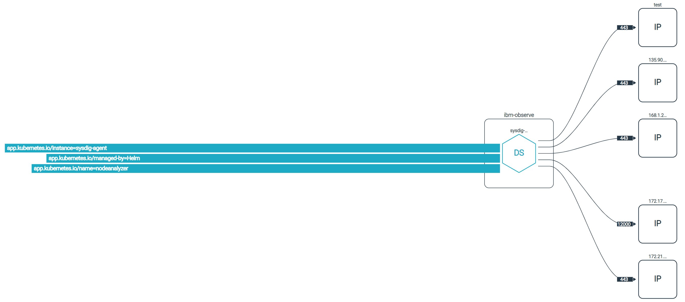

---

copyright:
  years:  2023
lastupdated: "2023-05-10"

keywords:

subcollection: workload-protection

---

{{site.data.keyword.attribute-definition-list}}

# Kubernetes Network Policies
{: #netsec_policy}

You can generate Kubernetes Network Policies (KNPs) using the {{site.data.keyword.sysdigsecure_full}} network security policy tool and check a topology map for defined policies and make updates.
{: shortdesc}

There are four steps to generate KNPs using the {{site.data.keyword.sysdigsecure_full_notm}} network security policy tool:

* [Setting the scope.](#knp_scope)

* [Reviewing ingress and egress and customizing communications as required.](#knp_coms)

* [Reviewing the topology map.](#knp_map)

* [Generating the policy and downloading the policy file.](#knp_file)

## Setting the scope
{: #knp_scope}

The scope selects the Kubernetes entity and timeframe for aggregate communications.

Communications are aggregated using Kubernetes metadata.  This avoids including entities that are not relevant to the policy. For example, if pod A under deployment A communicates multiple times with pod B under deployment B, only one entry will appear in the UI. Or, if pod A1 and pod A2 are both under deployment A, and both communicate with pod B, deployment A will represent all its pods.

To set the scope, do the following:

1. Open the [{{site.data.keyword.sysdigsecure_short}} UI](/docs/workload-protection?topic=workload-protection-launch).

2. Click the Network icon .

3. Select your **Cluster** and **Namespace**.

4. Select the type of Kubernetes entity.

    * `Service`
    * `Deployment`
    * `Daemonset`
    * `Stateful Set`
    * `ChronJob` - Choose this option to have communication aggregated at the scheduler level rather than the job. This can reduce extraneous entries.
    * `Job` - Choose this option to see entries where a `job` has no `chronjob` parent.

5. Select the timespan you would like to see at the bottom of the page.

## Reviewing and cusomizing ingress and egress
{: #knp_coms}

Use the **Ingress** and **Egress** tabs to see the communications for the selected entity and time period.

You can use the  to include a listed communication or the  to exclude the communication from the policy.

You can also use **General ingress rules** to block all, allow all inside the namespace, or allow all in the policy.

Sometimes it might not be possible to resolve an endpoint using Kubernetes metadata and classification. For example, if a microservice is communicating with an external web server and the external IP address is not associated with Kubernetes metadata in your cluster.  You will see these entities listed as **UNRESOLVED IPs**. By default, unresolved IP addresses are excluded from the KNP, but you can add them manually by clicking the  and them mapping the IP addresses to an alias.

You can filter the list of unresolved IP addresses to show only **Internal**, **External**, **Aliased**, **Unknown** IP addresses or a combination of these.

**Internal**
:   IP addresses that are found within the cluster.

**External**
:   IP addresses that are not within the cluster.

**Aliased**
:   IP addresses that have aliases associated with them.

**Unknown**
:   IP addresses that cannot be determined to be **Internal** or **External**.

## Reviewing the topology
{: #knp_map}

You can use the **Topology** tab to see a graphical representation of the policy.  The view is a high-level Kubernetes metadata view of pod owners, listening ports, service and labels. You can hover over items in the topology to see all the relevant details for entities and communications.

{: caption="Example topology" caption-side="bottom"}

The color of topology items indicates the status.

Lines
:   Black - The connection is resolved.

    Red - The connection is not resolved. The communication is not included in the generated policy. To resolve the issue, use the [ingress and egress tabs](#knp_coms) to include the connection.

Entities
:   Blue - The workload is included.

    Black - Indicates other services and deployments the included workload communicates with.

## Generating the policy file
{: #knp_file}

You can view the generated policy in `yaml` format on the **Generated Policy** tab.

Click **Download Policy** to download a copy of the generated policy to your local system.
