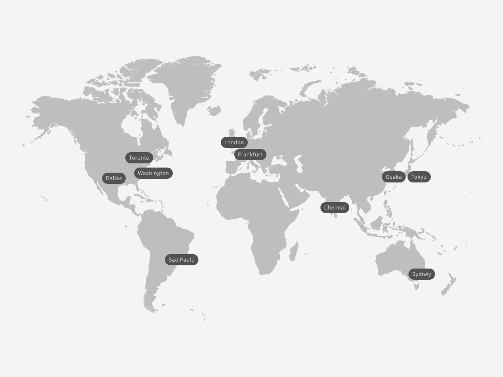

---

copyright:
  years:  2023, 2026
lastupdated: "2026-07-30"

keywords:

subcollection: workload-protection

---

{{site.data.keyword.attribute-definition-list}}

# Regions
{: #supported-regions}

The {{site.data.keyword.sysdigsecure_full_notm}} service is available in the following regions:
{: shortdesc}

{: caption="Displays the regions where you can create and manage {{site.data.keyword.sysdigsecure_full_notm}} resources." caption-side="bottom"}

This image is an artistic representation and does not reflect actual political or geographic boundaries.
{: note}

You can create {{site.data.keyword.sysdigsecure_full_notm}} resources in one of the supported {{site.data.keyword.cloud_notm}} locations, which represent the geographic area where your {{site.data.keyword.sysdigsecure_full_notm}} requests are handled and processed.

The following table lists the locations where the service is available:

| Geography             | Region                   | EU-Supported | HA Status |
|-----------------------|--------------------------|--------------|-----------|
| `Asia Pacific`        | `Sydney (au-syd)`        | `N/A`        | `MZR`     |
| `Asia Pacific`        | `Osaka (jp-osa)`         | `N/A`        | `N/A`     |
| `Asia Pacific`        | `Tokyo (jp-tok)`         | `N/A`        | `MZR`     |
| `Europe`              | `Frankfurt (eu-de) (*)`  | `YES`        | `MZR`     |
| `Europe`              | `London (eu-gb)`         | `NO`         | `MZR`     |
| `North America`       | `Dallas (us-south)`      | `N/A`        | `MZR`     |
| `North America`       | `Washington (us-east)`   | `N/A`        | `MZR`     |
| `North America`       | `Toronto (ca-tor)`       | `N/A`        | `MZR`     |
| `South America`       | `Sao Paulo (br-sao)`     | `N/A`        | `MZR`     |
{: caption="Locations where the service is available" caption-side="bottom"}

Geography
:   A geographic area or larger political body that contains one or more regions.

Region
:   A defined geographic territory. A region might be a specific postal code area, a town, a city, a state, a group of states, or even a group of countries.

N/A
:   Feature that is not applicable to that geography.

`(*)` For more information, see [Enabling EU support for your account](/docs/account?topic=account-eu-supported).
